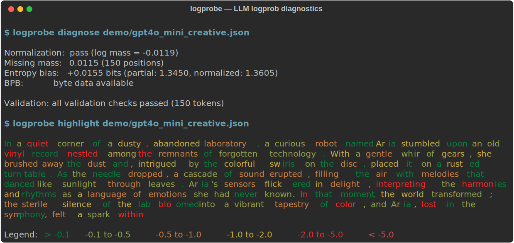

# logprobe

Most logprob analysis pipelines silently assume normalized, complete distributions. In practice, top-k truncation and raw logits violate these assumptions, leading to systematically biased entropy and perplexity estimates.

logprobe detects these problems. It quantifies missing probability mass, catches unnormalized scores, and tells you exactly how much your entropy estimates are off.

<p align="center">
  
</p>

## Real results on production API data

Tested on actual GPT-4o-mini and GPT-4.1-nano responses (April 2025). Raw JSON responses are in `demo/`.

**Creative writing** (GPT-4o-mini, temperature=0.7, top_logprobs=20):

```
$ logprobe diagnose demo/gpt4o_mini_creative.json

Normalization:  pass (log mass = -0.0119)
Missing mass:   0.0115 (150 positions)
Entropy bias:   +0.0155 bits (partial: 1.3450, normalized: 1.3605)
BPB:            byte data available

Validation: all validation checks passed (150 tokens)
```

Even with top-20, 1.15% of probability mass is missing. The entropy bias is small but measurable.

**GPT-2 with top-5** (the common case — most API calls default to top-5):

```
$ logprobe diagnose demo/gpt2_openai.json

Normalization:  pass (log mass = -0.5687)
Missing mass:   0.3001 (2/9 positions >50% missing)
Entropy bias:   +0.3743 bits (partial: 1.1134, normalized: 1.4876)
BPB:            byte data available

Validation: all validation checks passed (9 tokens)
```

30% of probability mass is missing. Two positions have >50% missing mass and are flagged UNRELIABLE.

**Raw logits passed as logprobs** (logprobe catches it immediately):

```
$ logprobe diagnose demo/gpt2_logits_openai.json

Normalization:  FAIL (log mass = 12.0840 — likely raw logits)
...
Validation: 63 error(s) found
  [ERROR] nonpositive_logprob (position 0): token " quick" has positive logprob 4.2831 ...
```

## The problem

LLM APIs return top-k logprobs for a position:

```
token       logprob     probability
"Hello"     -0.50       0.607
"Hi"        -2.00       0.135
"Hey"       -3.50       0.030
"Greetings" -4.10       0.017
"Good"      -4.80       0.008
                  total: 0.797
```

The observed tokens account for 79.7% of the probability mass. The remaining 20.3% is spread across thousands of unseen tokens. Renormalized top-k entropy is a lower bound on the true entropy (assuming correct top-k extraction) — but most tools present it as the actual value. If the API returned raw logits instead of log-probabilities (it happens), every metric silently produces garbage.

## Install

From source (latest):
```
cargo install --git https://github.com/Robby955/logprobe
```

From crates.io:
```
cargo install logprobe
```

## Commands

```
logprobe diagnose <file>              Detect normalization errors, entropy bias, and invalid distributions
logprobe validate <file>              Check logprob data integrity (finite, sorted, no duplicates, mass <= 1)
logprobe summary <file>               Sequence statistics (mean logprob, perplexity, missing mass)
logprobe entropy <file>               Per-token entropy from top_logprobs (partial and normalized)
logprobe confidence <file>            Find low-confidence tokens with surrounding context
logprobe bpb <file>                   Bits-per-byte (strict: requires explicit byte counts)
logprobe highlight <file>             Terminal visualization colored by confidence
logprobe compare <file_a> <file_b>    Side-by-side comparison of two logprob files
logprobe batch <dir_or_file>          Process multiple files and output a summary table
```

All commands read from stdin if no file is given. Add `--json` for machine-readable output.

### compare

Compare two logprob files side-by-side. Shows perplexity, mean logprob, entropy, missing mass, and BPB deltas with colored output (green = improvement, red = regression).

```
$ logprobe compare response_a.json response_b.json

                     response_a.json   response_b.json          delta
Tokens                           150               150
Perplexity                      1.95              1.02         -0.930
Mean logprob                   -0.67             -0.02         +0.650
Entropy (partial)               1.35              0.03         -1.315
Missing mass                   0.012             0.001        -0.0107
BPB                             0.49              0.01         -0.475
```

### batch

Process a directory of `.json` files (or a single file) and output a CSV summary table with per-file metrics. Useful for comparing model outputs across many prompts.

```
$ logprobe batch responses/
file,model,format,tokens,perplexity,mean_logprob,missing_mass,entropy_bias,normalization,bpb,error
creative.json,gpt-4o-mini-2024-07-18,openai,150,1.95,-0.67,0.0115,0.0155,pass,0.49,
factual.json,gpt-4o-mini-2024-07-18,openai,42,1.01,-0.01,0.0010,0.0003,pass,0.01,
```

## Supported providers

logprobe auto-detects the input format. Use `--format <name>` to override.

| Provider | Format | Status |
|----------|--------|--------|
| **OpenAI** (GPT-4o, GPT-4.1, GPT-4.1-mini/nano) | `openai` | Tested — fixtures in `demo/` |
| **GPT-2** (local via HuggingFace) | `openai` | Tested — fixtures in `demo/` |
| **Ollama** (Llama, Gemma, Qwen, etc.) | `ollama` | Tested — fixture in `demo/` |
| **vLLM** (any model) | `vllm` | Tested — fixture in `demo/` |
| **Google Gemini** | `gemini` | Parser exists (not tested — see note) |
| **JSONL / custom** | `jsonl` | One `{"token", "logprob"}` per line |

Any OpenAI-compatible API (Together AI, Groq, Azure, xAI, Mistral, DeepSeek, Fireworks, HuggingFace TGI, Amazon Bedrock, NVIDIA NIM) should work with the `openai` format, but these have not been tested directly.

**No logprobs API**: Anthropic/Claude, Perplexity, OpenAI reasoning models (o1, o3, o4-mini).

**Google Gemini**: logprobe can parse Gemini's native JSON format (`logprobsResult`, `logProbability`), but Google has restricted logprob access on recent models. A sample fixture is included in `demo/` but was not generated from a live API call.

## Why strict BPB

Most tools compute bits-per-byte as `-total_logprob / (total_bytes * ln(2))` where `total_bytes = sum(token.as_bytes().len())`. This is wrong for BPE tokenizers — tokens like `" Hello"` have a leading space byte that inflates the count, and special tokens have no meaningful byte representation at all.

logprobe refuses to compute BPB unless the API provides explicit byte arrays for each token. If your data doesn't include byte counts, logprobe tells you why instead of giving you a wrong number.

## Library usage

logprobe is also a library crate:

```rust
use logprobe::parse;
use logprobe::diagnostics;

let input = std::fs::read_to_string("response.json")?;
let seq = parse::parse_string(&input, None, false)?;

// Structured report
let report = diagnostics::diagnose_report(&seq);
println!("normalization: {:?}", report.normalization_status);
println!("mean missing mass: {:.4}", report.mean_missing_mass);
println!("entropy bias: {:+.4} bits", report.entropy_bias);

// Or flat findings list
let findings = diagnostics::diagnose(&seq);
for f in &findings {
    println!("[{:?}] {}: {}", f.severity, f.check, f.message);
}
```

## Research: entropy analysis of hallucination

The [`research/`](research/README.md) directory contains logprob analysis of GPT-4o-mini — 6 experiments, 18 data files, 4 models, 3 languages. Key observations:

**Entropy spikes coincide with hallucination.** We asked GPT-4o-mini four questions ranging from trivial ("What is 2+2?") to impossible ("Who was the 23rd person to walk on the moon?" — only 12 people have). The model hallucinated "Charles Duke." The single most uncertain token in the entire 60-token response was "is" (entropy 0.33 bits, logprob -2.81) — right before the fabricated name. Every other token had near-zero entropy.

```
logprobe confidence -t -0.5 research/data/confidence_gradient.json

Position 56: logprob=-2.8120 (p=0.060087)
  Context: ... on the moon[ is] Charles Duke.
```

**Refusal has higher perplexity than fabrication.** When the model correctly refused to answer about a fictional person, its perplexity was 1.56 with 20 uncertain tokens. When it confidently fabricated a wrong year for a real rifle model, perplexity was 1.02.

Other observations (N=1 per comparison — treat as illustrative, not conclusive):
- **Temperature affects perplexity but not missing mass** — top-20 captures 99.98% even at temp=1.5
- **Creative writing entropy is 4.6x code** at the same temperature
- **Japanese BPB is 1.4x French** due to multi-byte UTF-8, not model uncertainty
- **GPT-4.1-mini was the most confident** of the four models tested on one prompt

All data files and logprobe commands to reproduce every number are in `research/`.

## Demo fixtures

The `demo/` directory contains real API responses and sample fixtures across multiple providers. See [demo/README.md](demo/README.md) for the full breakdown.

| Model | Task | Missing mass | Entropy bias | Perplexity |
|-------|------|-------------|-------------|------------|
| GPT-4o-mini | Creative (top-20, t=0.7) | 1.15% | +0.016 bits | 1.95 |
| GPT-4o-mini | Code (top-5, t=0) | ~0% | ~0 bits | 1.00 |
| GPT-4o-mini | Factual (top-5, t=0) | 0.10% | ~0 bits | 1.01 |
| GPT-2 | Scoring (top-5) | 30.0% | +0.374 bits | 5.39 |

## License

MIT
